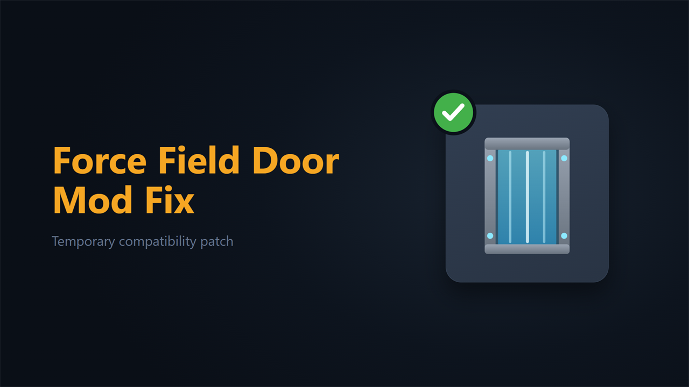

# Force Field Door Mod Fix

> ## No longer needed
>
> **The original ForceFieldDoorMod was fixed by its author on 6 July 2026 and now works on its own, so this compatibility fix is no longer required.** You can safely unsubscribe. It is also safe to leave it enabled: it detects that ForceFieldDoorMod is fixed and does nothing.

A temporary compatibility fix that keeps ForceFieldDoorMod working on current Stationeers builds until its author updates it.

Full multiplayer compatibility. Safe to add to and remove from existing savegames.

> **WARNING:** This is a StationeersLaunchPad mod. It requires [BepInEx](https://docs.bepinex.dev/) and [StationeersLaunchPad](https://github.com/StationeersLaunchPad/StationeersLaunchPad) to be installed. It also requires [ForceFieldDoorMod](https://steamcommunity.com/sharedfiles/filedetails/?id=3328065049), the mod it fixes.

This is not original work. It exists only to keep [ForceFieldDoorMod](https://steamcommunity.com/sharedfiles/filedetails/?id=3328065049) by WIKUS and BoNes running after a game update broke it. Once the original mod is updated, this fix is no longer needed and should be removed.

## What it fixes

ForceFieldDoorMod was built against an older Stationeers build. Its force field door overrides `OnAtmosphericTick` and calls the one-argument `GridController.CanContainAtmos(WorldGrid)` at two places. Stationeers 0.2.6403 removed that overload; only the two-argument `CanContainAtmos(WorldGrid, bool allowCrewModules = true)` remains. Mono throws `MissingMethodException` the first time it compiles the door's tick method, which happens on the first atmospheric tick of any world that contains a force field door. The exception is blamed on the vanilla caller and takes down the whole `GameTick` simulation section, every tick. The world loads, but nothing simulates: no atmospherics, no power, no growth.

## How it works

At load, this mod checks whether ForceFieldDoorMod is present and still affected:

- If ForceFieldDoorMod is absent, it does nothing.
- If ForceFieldDoorMod has already been updated (the stale call is gone), it stands down and does nothing.
- If ForceFieldDoorMod is present and still broken, it takes over the force field door's atmospheric tick and runs a corrected version that calls the surviving two-argument `CanContainAtmos` overload. The door keeps its variable power draw, and the simulation keeps running.

It never edits ForceFieldDoorMod's files on disk, and it has no settings. It works the same on clients and dedicated servers.

The fix cannot rewrite an already-loaded assembly, and it cannot Harmony-patch the broken method (patching forces the same failing compile). Instead it intercepts the game's per-thing atmospheric dispatch, skips the broken method so it is never compiled, and runs its own corrected copy in its place. Load order does not matter, because the interception happens at simulation time, long after every mod has loaded. See [RESEARCH.md](RESEARCH.md) for the full mechanism.

## Installation

Subscribe on the Steam Workshop, or copy `ForceFieldDoorModFix.dll` and the `About/` folder into your Stationeers local mods directory. Restart the game. Load order relative to ForceFieldDoorMod does not matter.

## Compatibility

**Requires:** BepInEx + StationeersLaunchPad + ForceFieldDoorMod.

**All players** on a server should run the same setup. Matching mod versions are enforced during the connection handshake automatically. Dedicated servers need it installed server-side too.

## Reporting Issues

If you run into a bug or something behaves unexpectedly, please open an issue on [GitHub](https://github.com/SixFive7/StationeersPlus/issues). Please include the mod name in the title so reports can be triaged. Steam comment notifications don't always come through, so GitHub is the reliable way to make sure a report is seen.

## Changelog

Version history lives in [`ForceFieldDoorModFix/About/About.xml`](ForceFieldDoorModFix/About/About.xml) under `<ChangeLog>` and, for the complete history, in [CHANGELOG.md](CHANGELOG.md).

## Credits

- **WIKUS and BoNes**: created [ForceFieldDoorMod](https://steamcommunity.com/sharedfiles/filedetails/?id=3328065049). All credit for the force field door belongs to them; this mod only keeps their work running after a game update.

## License

Apache License 2.0. See [LICENSE](../../LICENSE) for the full text and [NOTICE](../../NOTICE) for attribution.
