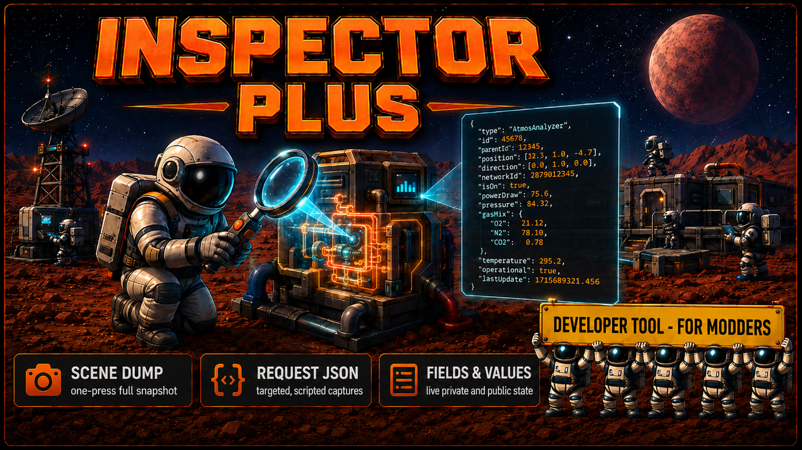

# Inspector Plus

Developer tool that dumps live Stationeers runtime state to JSON on demand for mod development.

> **WARNING:** This is a StationeersLaunchPad mod. It requires [BepInEx](https://docs.bepinex.dev/) and [StationeersLaunchPad](https://github.com/StationeersLaunchPad/StationeersLaunchPad) to be installed.

Not intended for end-user gameplay. Subscribe only if you are writing or debugging a Stationeers mod. The plugin reads field and property values from live scene objects and writes them to JSON snapshots on disk, so a developer can diff runtime state across frames or game events without adding one-off logging.

## Installation

1. Copy `InspectorPlus.dll` and the `About/` folder into your Stationeers local mods directory
2. Restart the game
3. The `BepInEx/inspector/requests/` and `BepInEx/inspector/snapshots/` folders are created automatically on first load

## Features

### On-Demand Snapshots via Request JSON
Drop a request JSON into `BepInEx/inspector/requests/` specifying types and fields to inspect. The plugin writes a snapshot into `BepInEx/inspector/snapshots/snapshot_<timestamp>.json` and deletes the request. This is the programmatic path: drop the file, get the result.

### F8 Full-Scene Dump
Press F8 in-game to dump every MonoBehaviour in the current scene to the same snapshots folder in one shot. Useful for the first-pass "what is in the scene right now" survey.

### Field, Property, and Unity Position Capture
Dumps private and public fields, computed properties, and Unity Transform positions. Walks nested objects to a configurable depth, with cycle detection.

## Compatibility

**Requires:** BepInEx + StationeersLaunchPad

**Single-player and multiplayer.** Works on any instance where it is installed. This is a developer tool; do not require it on a shared server.

## Reporting Issues

If you run into a bug or something behaves unexpectedly, please open an issue on [GitHub](https://github.com/SixFive7/StationeersPlus/issues). Please include the mod name in the title so reports can be triaged. Steam comment notifications don't always come through, so GitHub is the reliable way to make sure a report is seen.

## Changelog

Version history lives in [`InspectorPlus/About/About.xml`](InspectorPlus/About/About.xml) under `<ChangeLog>`. Once the mod is published to the Steam Workshop, entries will also appear on the Workshop Change Notes tab with every release.

## License

Apache License 2.0. See [LICENSE](../../LICENSE) for the full text and [NOTICE](../../NOTICE) for attribution.
