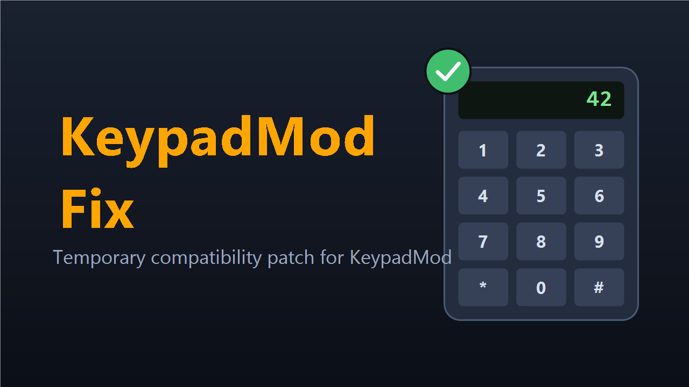

# KeypadMod Fix

A temporary compatibility patch that restores WIKUS's KeypadMod to working order on the current build of Stationeers.

Full multiplayer compatibility. Safe to add or remove at any time; it only patches KeypadMod while KeypadMod is installed, and does nothing on its own.

> **WARNING:** This is a StationeersLaunchPad mod and an add-on for [KeypadMod](https://steamcommunity.com/sharedfiles/filedetails/?id=3478434324) by WIKUS. It requires [BepInEx](https://docs.bepinex.dev/), [StationeersLaunchPad](https://github.com/StationeersLaunchPad/StationeersLaunchPad), and KeypadMod itself. It does not replace KeypadMod.

This patch is temporary. It exists only until WIKUS updates KeypadMod at the source; once that happens, remove this mod.

## Installation

1. Install KeypadMod (by WIKUS) if you have not already.
2. Copy `KeypadModFix.dll` and the `About/` folder into your Stationeers local mods directory, or subscribe on the Steam Workshop.
3. Restart the game.

## What it fixes

A Stationeers update changed a method in the game's bundled UniTask library, which broke KeypadMod (it was built against an older version). This patch corrects the two resulting problems at runtime, without modifying KeypadMod itself.

### Keypad crash on keypress

Pressing any number button threw a `MissingMethodException` on `UniTask.Delay` and the keypad stopped responding. The keypress pulse works again.

### Screen input on multiplayer and dedicated servers

Typing a value into the keypad screen as a multiplayer client did nothing (the field kept showing the old value, often 0). Values now apply correctly. Single-player was never affected.

## How it works

KeypadMod Fix is a small BepInEx plugin. It waits until StationeersLaunchPad has loaded every mod, then resolves `keypadmod.Keypad` by name. If KeypadMod is not installed, it logs that and does nothing. If it is present, it applies two Harmony prefixes:

- `PulseMode` is skipped and re-run with a copy compiled against the current UniTask, so the delay call resolves.
- `ProcessInputValue` is skipped and re-run so the client-to-server logic message carries the correct `LogicType` (the value KeypadMod left unset), which is what the server needs to apply the input.

Nothing from KeypadMod is copied or redistributed; the patch operates on the installed copy.

## Compatibility

**Requires:** BepInEx + StationeersLaunchPad + [KeypadMod](https://steamcommunity.com/sharedfiles/filedetails/?id=3478434324) by WIKUS

**All players** on a server must have the same mods installed. **Dedicated servers** need BepInEx, StationeersLaunchPad, KeypadMod, and KeypadMod Fix installed server-side. Both fixes matter there: the crash runs on the server, and the screen-input fix is the one dedicated-server players were missing.

## Reporting Issues

If you run into a bug or something behaves unexpectedly, please open an issue on [GitHub](https://github.com/SixFive7/StationeersPlus/issues) with "KeypadMod Fix" in the title. Steam comment notifications don't always come through, so GitHub is the reliable way to make sure a report is seen. Bugs in KeypadMod's own features belong on the KeypadMod page, not here.

## Changelog

Version history lives in [`CHANGELOG.md`](CHANGELOG.md) and in [`KeypadModFix/About/About.xml`](KeypadModFix/About/About.xml) under `<ChangeLog>`, published on the Steam Workshop Change Notes tab with every release.

## Credits

- **WIKUS**: created [KeypadMod](https://steamcommunity.com/sharedfiles/filedetails/?id=3478434324), the mod this patch supports. All credit for the keypad itself goes to WIKUS.

## License

Apache License 2.0. See [LICENSE](../../LICENSE) for the full text and [NOTICE](../../NOTICE) for attribution.
