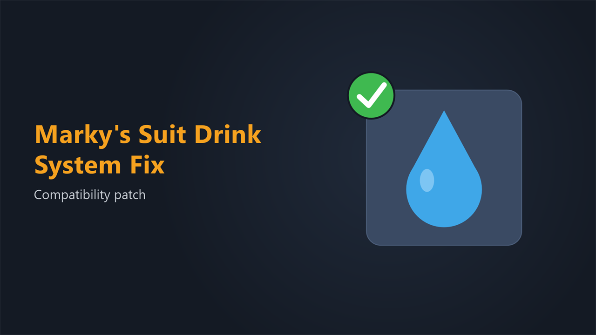

# Marky's Suit Drink System Fix

A temporary compatibility patch that restores Marky's Suit Drink System to working order on the current build of Stationeers.

Full multiplayer compatibility. Safe to add or remove at any time; it only patches Marky's Suit Drink System while that mod is installed, and does nothing on its own.

> **WARNING:** This is a StationeersLaunchPad mod and an add-on for [Marky's Suit Drink System](https://steamcommunity.com/sharedfiles/filedetails/?id=3644610659) by Marky. It requires [BepInEx](https://docs.bepinex.dev/), [StationeersLaunchPad](https://github.com/StationeersLaunchPad/StationeersLaunchPad), and Marky's Suit Drink System itself. It does not replace that mod.

This patch is temporary. It exists only until Marky updates Marky's Suit Drink System at the source; once that happens, remove this mod.

## Installation

1. Install Marky's Suit Drink System (by Marky) if you have not already.
2. Copy `MarkysSuitDrinkSystemFix.dll` and the `About/` folder into your Stationeers local mods directory, or subscribe on the Steam Workshop.
3. Restart the game.

## What it fixes

The Sanitation update changed a hydration method in the game (`Entity.Hydrate` now takes a gas mole quantity instead of a plain number). Marky's Suit Drink System still calls the old form, so drinking from the suit broke. Because the missing method is resolved when the mod's patch is compiled, the error fired on every frame the suit inventory refreshed its interaction text, not only when you drank.

### Log spam and broken drinking

Interacting with a suit that has the Water Tank slot threw a `MissingMethodException` on `Entity.Hydrate` every frame the suit inventory was open, flooding the log, and the Drink action no longer hydrated you. Drinking water from the suit's water tank works again, and the spam is gone.

## How it works

Marky's Suit Drink System Fix is a small BepInEx plugin. It waits until StationeersLaunchPad has loaded every mod (`Prefab.OnPrefabsLoaded`), then checks whether Marky's `Suit.InteractWith` prefix is present. If it is not (his mod is absent or already updated), it logs that and does nothing. If it is present, it removes only that one prefix by its Harmony ID and installs a corrected `Suit.InteractWith` prefix compiled against the current game, which builds a water gas mole and calls `Entity.Hydrate(Mole)`.

Marky's other three patches (the Water Tank slot, the "Drink" interaction name, and the slot label) are left untouched; none of them call the removed method. Load order is enforced with an `<OrderAfter>` entry in `About.xml` and, as the hard guarantee, by deferring the work to `Prefab.OnPrefabsLoaded`, which runs after every plugin has applied its patches.

Nothing from Marky's Suit Drink System is copied or redistributed; the patch operates on the installed copy.

## Compatibility

**Requires:** BepInEx + StationeersLaunchPad + [Marky's Suit Drink System](https://steamcommunity.com/sharedfiles/filedetails/?id=3644610659) by Marky

**All players** on a server must have the same mods installed. **Dedicated servers** need BepInEx, StationeersLaunchPad, Marky's Suit Drink System, and this fix installed server-side.

## Reporting Issues

If you run into a bug or something behaves unexpectedly, please open an issue on [GitHub](https://github.com/SixFive7/StationeersPlus/issues) with "Marky's Suit Drink System Fix" in the title. Steam comment notifications don't always come through, so GitHub is the reliable way to make sure a report is seen. Bugs in Marky's Suit Drink System's own features belong on that mod's page, not here.

## Changelog

Version history lives in [`CHANGELOG.md`](CHANGELOG.md) and in [`MarkysSuitDrinkSystemFix/About/About.xml`](MarkysSuitDrinkSystemFix/About/About.xml) under `<ChangeLog>`, published on the Steam Workshop Change Notes tab with every release.

## Credits

- **Marky**: created [Marky's Suit Drink System](https://steamcommunity.com/sharedfiles/filedetails/?id=3644610659), the mod this patch supports. All credit for the suit drink system itself goes to Marky.

## License

Apache License 2.0. See [LICENSE](../../LICENSE) for the full text and [NOTICE](../../NOTICE) for attribution.
