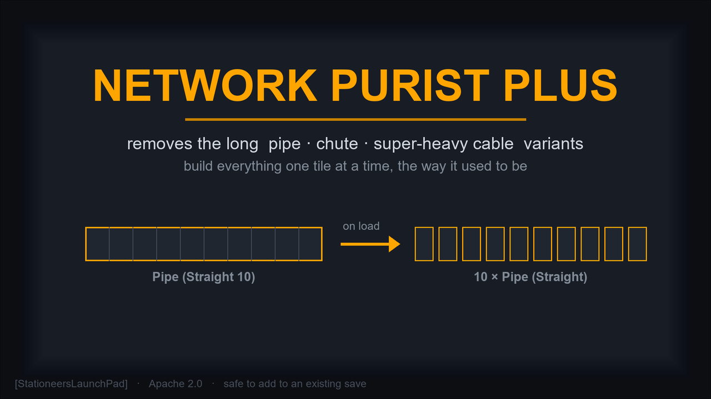

# Network Purist Plus

Removes the long (3-, 5-, and 10-segment) straight pipe, chute, and super-heavy cable variants and aligns straight cables to one consistent orientation; existing worlds are converted when a save loads.

Full multiplayer compatibility. Safe to add to an existing savegame.

> **WARNING:** This is a StationeersLaunchPad mod. It requires [BepInEx](https://docs.bepinex.dev/) and [StationeersLaunchPad](https://github.com/StationeersLaunchPad/StationeersLaunchPad) to be installed.

## Installation

1. Copy `NetworkPuristPlus.dll` and the `About/` folder into your Stationeers local mods directory.
2. Restart the game.

## Features

### Long pieces removed everywhere

Stationeers ships "long" straight building pieces: 3-, 5-, and 10-segment variants you build (or merge existing runs into) instead of placing single tiles. This mod takes them out of the game's menus:

| Family | Long variants removed |
|---|---|
| Gas pipe | `StructurePipeStraight3` / `5` / `10` |
| Insulated gas pipe | `StructureInsulatedPipeStraight3` / `5` / `10` |
| Liquid pipe | `StructurePipeLiquidStraight3` / `5` / `10` |
| Insulated liquid pipe | `StructureInsulatedPipeLiquidStraight3` / `5` / `10` |
| Chute | `StructureChuteStraight3` / `5` / `10` |
| Super-heavy cable | `StructureCableSuperHeavyStraight3` / `5` / `10` (the only cable tier with long variants) |

They are stripped from the build-kit mouse wheel and hidden from the Stationpedia (page list and search). The merge-with-a-tool action can no longer produce a long piece either. You build pipes, chutes, and cables one tile at a time, the way it worked before the merge feature was added. The long-variant prefabs themselves stay registered so old saves still load (see below).

### Existing long runs rebuilt on load

When a save loads, every already-placed long pipe, chute, or cable run is rebuilt from the equivalent single-tile pieces at the same cells, with the same rotation and custom colour, then the long piece is removed. Networks stay connected, but rebuilt pipe runs start empty -- the gas inside a long pipe run is not preserved; re-pressurize them. This is a one-time conversion the first time you load a world after installing the mod (and again for any world a long piece sneaks into, for example from another mod). It runs on the host / single-player only; clients receive the rebuilt world through the normal sync.

A long piece that turns up mid-game -- a blueprint paste, another mod's `upgrade` command -- is expanded into single tiles the moment it is built, so it does not have to wait for the next world load. (The one exception is a blueprint paste of a long piece on a client that does not have this mod; that one is still caught only on the next load by the host.)

### Cable alignment

A straight cable is a tube with a coloured band along the side, but the game lets a straight cable be placed at any of four "rolls" about its run direction (it treats them as 24 box orientations with no symmetry, unlike straight pipes). So a cable placed one way next to a cable placed another way shows the band misaligned -- you see it most on super-heavy cables, and it crops up easily when zoop-built and hand-built cables meet, or after pressing the rotate key. (It is purely cosmetic: the game does not care about a straight cable's roll for connectivity, networks or anything else.)

This mod picks one orientation per run axis -- the same set the game uses for straight pipes -- and applies it:

- **On load:** every already-placed straight cable, all tiers, is realigned. Host / single-player only; clients get the corrected rotations through the normal sync.
- **As you build:** a freshly placed straight cable snaps to the canonical orientation the instant it registers, whatever the cursor showed. Building with [ZoopMod](https://steamcommunity.com/sharedfiles/filedetails/?id=3310094883), pasting a blueprint with [BlueprintMod](https://steamcommunity.com/sharedfiles/filedetails/?id=3672138641), rotating the cursor -- all still work; they just produce an aligned cable. The rotate key on a cable becomes preview-only as a result.
- **Build cursor:** the single-tile straight pipe, cable and chute in each kit is given the "straight" connection type, so the cursor and the smart-rotate cycle behave consistently, and the merge-with-tool action keeps working now that the long straight variants are gone from the kits. (Without that last part, merging two collinear pipes or cables with the exit tool throws an error -- this also fixes that latent v1.0 issue.)

Cosmetic only -- connectivity, networks, colour, paint and everything else are untouched.

### Plays nicely with drag-build mods

With [ZoopMod](https://steamcommunity.com/sharedfiles/filedetails/?id=3310094883) installed, zooping a long stretch of pipe, chute, or cable just places single-tile pieces instead of the long variants (ZoopMod discovers long variants by inspecting the kit's option list, which this mod has emptied of them), already aligned for cables. [NetworkUpgrader](https://steamcommunity.com/sharedfiles/filedetails/?id=3656955459)'s `upgrade` command and the in-game merge tool likewise can no longer create long pieces.

### Settings

All settings are server-authoritative: the host's values are the ones that take effect, and every player on a server (and a dedicated server) must run the same values. A joining client whose settings differ from the host's is rejected at join time with a message saying which one to change, the same way a version mismatch is rejected (see Compatibility below). They live in the in-game mod settings panel under the `Server - Pieces` and `Server - Cables` headers.

| Setting | Section | Default | What it does |
|---|---|---|---|
| Enable Network Purist Plus | Server - Pieces | on | Master switch. When off, the mod does nothing: long-piece variants stay in the build kits and the Stationpedia, no long run is rebuilt on load, no cable is realigned, the build cursor is left untouched. |
| Remove Long Gas Pipes | Server - Pieces | on | Removes the long `StructurePipeStraight3` / `5` / `10` variants: stripped from the kit, hidden from the Stationpedia, rebuilt from single tiles on load, rewritten if built mid-game. |
| Remove Long Liquid Pipes | Server - Pieces | on | Same, for the long `StructurePipeLiquidStraight3` / `5` / `10` variants. |
| Remove Long Insulated Pipes | Server - Pieces | on | Same, for the long insulated-pipe variants (`StructureInsulatedPipeStraight3` / `5` / `10` and `StructureInsulatedPipeLiquidStraight3` / `5` / `10` -- both insulated gas and insulated liquid). |
| Remove Long Chutes | Server - Pieces | on | Same, for the long `StructureChuteStraight3` / `5` / `10` variants. (An item in transit inside a destroyed segment is lost, as documented in Limitations.) |
| Remove Long Super-Heavy Cables | Server - Pieces | on | Same, for the long `StructureCableSuperHeavyStraight3` / `5` / `10` variants (the only cable tier with long variants; includes the burnt damage-state siblings). |
| Align Straight Cables | Server - Cables | on | Re-rolls every straight cable (all tiers) to one consistent orientation per run axis -- existing runs on load, new ones as built, and the build cursor for the straight-cable tiers that have no long variant. Cosmetic only; the cable rotate key becomes preview-only. When off, a cable's roll is left wherever it was placed. The merge-with-tool fix for the stripped pipe / chute / super-heavy-cable kits is governed by the per-family toggles above, not this one. |

The master toggle and the per-family toggles being server-authoritative is not just a multiplayer-fairness rule: stripping a variant from the build kits and hiding it from the Stationpedia happens at prefab-load time, which is before any client joins, so each machine first applies its own settings. The join check is what keeps everyone's build-kit option lists and Stationpedias in sync. Changing a setting takes effect on the next Stationeers restart (the prefab-time work runs once at boot); the world rebuild on load always uses the host's values.

## Limitations

- **Rebuilt pipe runs are emptied -- the gas inside a long pipe run is deleted when the run is rebuilt from single tiles.** This is by design, not a bug being chased: the game's atmospherics-event system loses a pipe network's gas when its pipes are replaced this way, there is no clean workaround, and the mod will not attempt to preserve it. Re-pressurize the new single-tile pipes. (Layout, rotation, colour and network connectivity are preserved; only the gas is lost.) It happens on the first load after installing the mod, and again for any long pipe that enters a world later -- via NetworkUpgrader, a blueprint paste, or the build-time rewrite if you build a long pipe.
- **An item in transit inside a long chute is deleted** -- an item physically moving through a long chute segment at the moment it is rebuilt is lost, also by design. Items sitting in chute bins are unaffected.
- The rotate key no longer changes a placed straight cable's roll -- a built cable always snaps to the canonical orientation for its run axis (this is the cable-alignment feature; it affects the cable preview, not gameplay).

## Compatibility

**Requires:** BepInEx + StationeersLaunchPad

**Verified compatible with [ZoopMod](https://steamcommunity.com/sharedfiles/filedetails/?id=3310094883) and [BlueprintMod](https://steamcommunity.com/sharedfiles/filedetails/?id=3672138641):** this mod's Harmony patches sit on `World.OnLoadingFinished`, `Cable.OnRegistered`, `Constructor.SpawnConstruct` and `Stationpedia.DataHandler.HandleThingPageOverrides` (plus a `Prefab.OnPrefabsLoaded` event subscription) -- none of which either of those mods patches -- so there is no patch conflict; they keep working and just produce single-tile, aligned pieces.

**Network enforcement:** Network Purist Plus uses LaunchPadBooster to require that every player (and every dedicated server) on a multiplayer game runs the same version of the mod *and* the same settings. A client without the mod, with a different version, or with different settings (any of the per-family toggles, the master toggle, or the cable-alignment toggle) is rejected at join time with a clear message. This is necessary because the build-kit option lists and the Stationpedia are reshaped at prefab-load time, before any client joins, so a mismatch would desync what each player sees in their build wheel. Also fine alongside NetworkUpgrader and the "no tool required for pipe/cable merging" mods (none of which can create long pieces while this mod is active).

**Dedicated servers** need the same BepInEx + StationeersLaunchPad + NetworkPuristPlus setup installed server-side, with the same settings as the connecting players. The server's copy is the one that rebuilds the world on load and realigns cables.

## Reporting Issues

If you run into a bug or something behaves unexpectedly, please open an issue on [GitHub](https://github.com/SixFive7/StationeersPlus/issues). Please include "[Network Purist Plus]" in the title so reports can be triaged. Steam comment notifications don't always come through, so GitHub is the reliable way to make sure a report is seen.

## Changelog

Version history lives in [`NetworkPuristPlus/About/About.xml`](NetworkPuristPlus/About/About.xml) under `<ChangeLog>` and is published on the [Steam Workshop Change Notes tab](https://steamcommunity.com/sharedfiles/filedetails/changelog/0) with every release.

## License

Apache License 2.0. See [LICENSE](../../LICENSE) for the full text and [NOTICE](../../NOTICE) for attribution.
