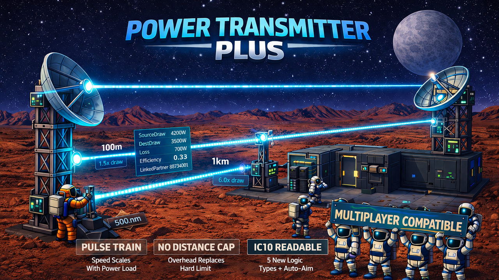

# Power Transmitter Plus



Adds a visible beam, scrolling pulses, a configurable distance cost, new logic readouts, and wall and ceiling placement to the Microwave Power Transmitter.

Full multiplayer compatibility. Safe to remove from existing savegames.

> **WARNING:** This is a StationeersLaunchPad mod. It requires [BepInEx](https://docs.bepinex.dev/) and [StationeersLaunchPad](https://github.com/StationeersLaunchPad/StationeersLaunchPad) to be installed.

## Installation

1. Copy `PowerTransmitterPlus.dll` and the `About/` folder into your Stationeers local mods directory
2. Restart the game

## Features

### Visible Laser Beam
A colored beam is drawn between a linked transmitter and receiver whenever the link is up, regardless of whether power is flowing. The beam is at full brightness at all times while visible, so you can see at a glance which dishes are actually connected. Power flow is shown by the pulse train (see below): when no power is flowing, the stripes freeze in place.

### Scrolling Pulse Train
Energy pulses scroll along the beam from transmitter to receiver. Stripe spacing is constant in world meters (same look on a 5m link or a 500m link). Scroll speed scales with power throughput, so a lightly-loaded link is clearly distinguishable from a heavily-loaded one at a glance.

### Distance Cost
Vanilla Stationeers caps microwave transmission capacity based on distance and hard-stops at 500m. This mod removes that cap entirely and replaces it with a source-draw overhead: the transmitter pulls more from its source cable network per watt delivered, proportional to link distance. Formula: for every watt delivered, the source pulls `1 + k * distance_km` watts. With the default `k = 5`:

| Distance | Watts drawn per watt delivered |
|---:|---:|
| 0 m | 1.0 |
| 100 m | 1.5 |
| 500 m | 3.5 |
| 1 km | 6.0 |
| 5 km | 26.0 |

You can transmit any distance you like, but long-range transmission is paid for in waste heat at the source.

If the source network cannot cover the distance overhead (a long link asked to deliver more than the source can pay for), the link self-limits instead of running away: the transmitter tracks its unpaid source-side backlog and pauses delivery while that backlog is above a safety ceiling (four times the per-tick worst case), resuming once the source pays it down. Devices sharing the source network are no longer browned out indefinitely by an impossible link, and a log warning naming the transmitter fires when a pause starts. There are no new settings for this; the ceiling derives from the existing `Cost Factor (k)` and `Max Transfer Capacity (W)` values.

### Max Transfer Capacity
By default a single transmitter has no throughput limit beyond what its cables and source network can supply, so one dish can carry as much power as you feed it instead of building several side by side. The host can set an optional `Max Transfer Capacity (W)` to clamp delivered power per transmitter; 0 (the default) means unlimited. The vanilla game limit was 5000 W per dish.

Links delivering more than 5 kW bill the source for the full amount. Before v1.9.0 the receiver's wireless-side drain stayed capped at the vanilla 5 kW, so anything above that accumulated as receiver debt and was never charged upstream (free energy).

### Logic Types
Six logic types are available on both the transmitter and the receiver, readable from configuration tablets and from IC10. Five are read-only readouts; the sixth, `MicrowaveAutoAimTarget`, is writable (see Auto-Aim below):

| Name | Access | Meaning |
|---|---|---|
| `MicrowaveSourceDraw` | Read | watts pulled from the source cable network |
| `MicrowaveDestinationDraw` | Read | watts delivered to the receiver's cable network |
| `MicrowaveTransmissionLoss` | Read | source minus destination (watts lost to distance) |
| `MicrowaveEfficiency` | Read | delivered / source as a 0..1 ratio |
| `MicrowaveLinkedPartner` | Read | ReferenceId of the linked partner dish (0 when unlinked) |
| `MicrowaveAutoAimTarget` | Read-Write | write a target's ReferenceId to aim the dish, 0 to disable; read returns the current target id |

The power readouts return 0 when the link is down, the device is off, or no power is flowing. `MicrowaveLinkedPartner` returns 0 only when unlinked, regardless of power state. On a transmitter it returns the linked receiver's ReferenceId; on a receiver it returns the linked transmitter's ReferenceId.

### Auto-Aim
`MicrowaveAutoAimTarget` is **writable** on both transmitter and receiver. Write a Thing's `ReferenceId` and the dish slews to point at it via the built-in servo; the base game's line-of-sight link raycast decides when the actual pairing forms, so obstacles in the path still take priority like in vanilla.

Auto-aim is per-dish and one-sided: setting the target on a transmitter does not touch its receiver, and vice versa. Manually adjusting `Horizontal` or `Vertical` (player, tablet, or IC10 `s d0 Horizontal ...`) cancels auto-aim. Writing 0 disables without moving the dish. Writing an unresolved id is a no-op. Cached targets persist across save/load and multiplayer join, so `MicrowaveAutoAimTarget` reads stay consistent across sessions.

When the target is itself a transmitter or receiver dish, auto-aim solves the joint mutual-aim geometry rather than treating the partner as a fixed point. The two dishes converge on a shared geometric fixed point regardless of which side was configured first or what either was aimed at before. The seed is canonical (root-to-root direction), so the result is invariant to prior aim history. After every save load, the post-load pass re-solves every cached pair and clears any cache entry whose target has been deconstructed, so existing saves repair themselves automatically.

The host can disable auto-aim entirely via the `Enable Auto-Aim` server setting. When disabled, `MicrowaveAutoAimTarget` is not registered at all: it does not appear in the tablet dropdown, IC10 compilation does not resolve the name, and nothing responds to writes at that LogicType. Clients whose local `Enable Auto-Aim` value does not match the host's are rejected at join time with a clear error message, so mixed installs cannot enter the same world.

Combine with `MicrowaveLinkedPartner` for closed-loop IC10 automation: aim at a target, confirm the link formed, and fall back if it did not. Example switching transmit target when remote batteries fill up:

```
define self_ref 12345     # this transmitter's ReferenceId
define batt_a  67890      # receiver A's ReferenceId
define batt_b  67891      # receiver B's ReferenceId

loop:
l r0 d0 Setting           # current charge ratio read from some sensor
blt r0 0.99 aim_a
s d0 MicrowaveAutoAimTarget batt_b
j wait
aim_a:
s d0 MicrowaveAutoAimTarget batt_a
wait:
yield
j loop
```

Example IC10 reading a single named transmitter on the data network:

```
define trans HASH("StructurePowerTransmitter")
define name HASH("Silicon Power Transmitter")

start:
lbn r0 trans name MicrowaveSourceDraw 0
lbn r1 trans name MicrowaveDestinationDraw 0
lbn r2 trans name MicrowaveTransmissionLoss 0
yield
j start
```

### Wall and Ceiling Placement

The Microwave Power Transmitter and Receiver dishes can be built on walls and ceilings as well as on the floor. While placing a dish, aim at any face the cursor would normally cycle through (floor, wall, or ceiling) and the placement preview snaps to that face automatically; rotation hotkeys cover all three axes once the cursor is on a non-floor face, so the dish can be oriented freely. Any combination of mount surfaces can form a link, including floor-to-wall, wall-to-ceiling, and ceiling-to-ceiling, as long as the two dishes point at each other.

Two link-side adjustments make this work alongside non-floor placement:

- The vanilla TX-RX link condition's right-axis-antiparallel check is dropped because it is geometrically unsatisfiable for two dishes mounted on different surface classes. The forward-axis-antiparallel check (within 7 degrees) still gates linking.
- `MicrowaveAutoAimTarget` aims the dish via a joint mutual-aim solve over both dishes, so a paired transmitter and receiver converge on a shared geometric fixed point regardless of mount orientation or distance. The link probe is a 0.5 m sphere cast filtered to receiver dish targets, so any sub-degree aim residual or mid-slew jitter still establishes the link cleanly.

The host can revert to vanilla floor-only placement via the `Allow Non-Floor Placement` server setting. Like `Enable Auto-Aim` this is restart-gated, and clients whose value disagrees with the host's are rejected at join time with a clear error message.

### Settings

All features are configurable via the mod settings panel.

All settings are server-authoritative: the host's values control gameplay and visuals for everyone. Changes to the visual, distance-cost, and capacity settings broadcast live to all connected clients on connect and on every change. `Enable Auto-Aim` and `Allow Non-Floor Placement` are restart-gated toggles, not live-broadcast settings: changing either requires a full Stationeers restart to take effect, and mismatches between client and host are caught at join time. The in-game settings panel groups the ten entries under six headers:

**Server - Features**:

| Setting | Default | Description |
|---|---|---|
| Enable Auto-Aim | true | Master toggle for the auto-aim feature. When off, `MicrowaveAutoAimTarget` and its IC10 / tablet / screen UI surface are not registered at all. Requires a full game restart to take effect. Client and host values must match; mismatched joins are rejected |

**Server - Placement**:

| Setting | Default | Description |
|---|---|---|
| Allow Non-Floor Placement | true | When on, transmitter and receiver dishes can be built on walls and ceilings as well as floors. When off, vanilla floor-only placement is preserved. Requires a full game restart to take effect. Client and host values must match; mismatched joins are rejected |

**Server - Capacity**:

| Setting | Default | Description |
|---|---|---|
| Max Transfer Capacity (W) | 0 (unlimited) | Maximum watts a single transmitter can deliver to its receiver. 0 = unlimited (default); a positive value caps delivered watts. The vanilla game limit is 5000 W. Lets one dish carry more power instead of building several side by side; actual throughput is still bound by cables and the source network |

**Server - Distance**:

| Setting | Default | Description |
|---|---|---|
| Cost Factor (k) | 5.0 | Per-kilometer overhead on transmitter source draw. `k = 0` disables the overhead entirely; `k = 10` doubles it compared to the default |

**Server - Pulse**:

| Setting | Default | Description |
|---|---|---|
| Stripe Wavelength | 2.0 | Distance in world meters between one pulse and the next |
| Scroll Speed | 25.0 | Pulse scroll speed in world meters per second at full power (5 kW delivered). Scales with `sqrt(intensity)` so low loads still move visibly |
| Trough Brightness | 0.5 | Beam brightness between pulses, 0..1 |

**Server - Visual**:

| Setting | Default | Description |
|---|---|---|
| Beam Color | 000DFF | Hex RGB color. 000DFF is the vanilla cyan-blue |
| Beam Width | 0.1 | Thickness of the beam in world meters |
| Emission Intensity | 10.0 | HDR brightness multiplier on the beam color |

## Compatibility

**Requires:** BepInEx + StationeersLaunchPad

**All players** on a server must have Power Transmitter Plus installed. Matching mod versions are enforced during the connection handshake automatically.

**Dedicated servers** need the same BepInEx + StationeersLaunchPad + PowerTransmitterPlus setup installed server-side. The distance-cost simulation runs server-authoritatively and the handshake rejects mixed installs.

**Custom logic types** registered by this mod sit in a reserved range outside the vanilla enum and the range used by Stationeers Logic Extended, so collisions with those are avoided. Another mod that registers a LogicType inside this mod's reserved range would collide; the exact range is documented in the source for mod authors who need it.

**Mod authors:** a public static API (`PowerTransmitterPlus.ModApi`) exposes the effective transfer capacity, live link distance, source-draw multiplier, and transfer-debt accessors, plus a billing-ownership handshake (`ClaimBillingOwnership` / `ReleaseBillingOwnership` / `BillingOwner`). A power-management mod that allocates power itself can claim wireless billing; while the claim is held, this mod's own debt billing and safety ceiling stand down, and the capacity advertise, beams, links, and logic readouts stay active. Members are only added, never renamed or removed, and the `Version` constant bumps on every addition. `DistanceCostShared.SourceDrawMultiplier` remains as a legacy reflection surface for older integrations.

## Reporting Issues

If you run into a bug or something behaves unexpectedly, please open an issue on [GitHub](https://github.com/SixFive7/StationeersPlus/issues). Please include the mod name in the title so reports can be triaged. Steam comment notifications don't always come through, so GitHub is the reliable way to make sure a report is seen.

## Changelog

The full version history lives in [`CHANGELOG.md`](CHANGELOG.md). The latest version's notes also ship in `About.xml` under `<ChangeLog>` and are published on the [Steam Workshop Change Notes tab](https://steamcommunity.com/sharedfiles/filedetails/changelog/3707677512) with every release.

## Credits

- **ThunderDuck**: Created [Stationeers Logic Extended](https://steamcommunity.com/sharedfiles/filedetails/?id=3625190467), which pioneered the pattern for registering custom LogicType values. The injection approach used here (extending `ProgrammableChip.AllConstants`, `Logicable.LogicTypes`, and the enum-name lookup paths) is adapted from that work.


## License

Apache License 2.0. See [LICENSE](../../LICENSE) for the full text and [NOTICE](../../NOTICE) for attribution.
