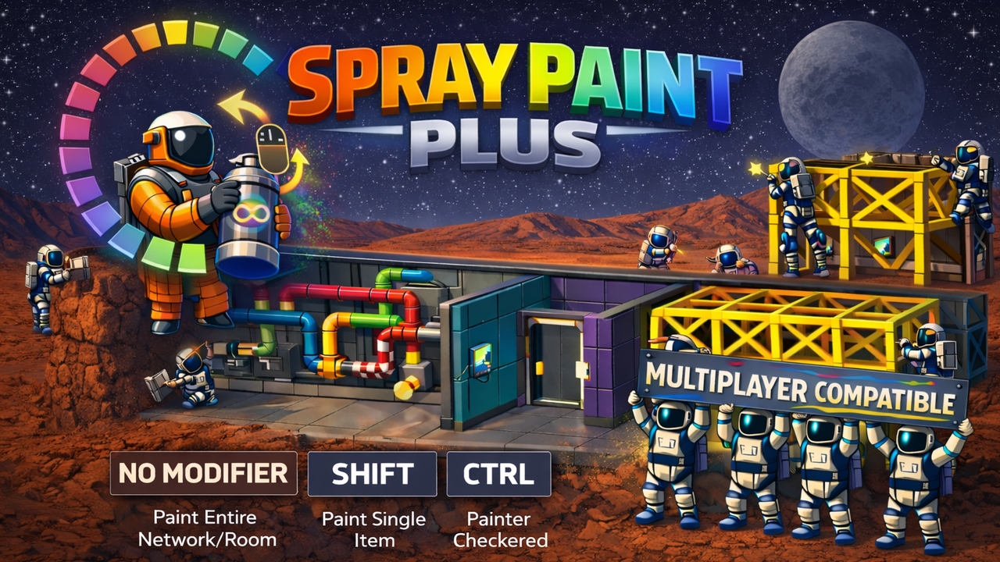

# Spray Paint Plus

Combines **color cycling**, **network painting**, **glow paint**, and **infinite spray paint** into one multiplayer-safe Stationeers mod.

> **WARNING:** This is a StationeersLaunchPad mod. It requires [BepInEx](https://docs.bepinex.dev/) and [StationeersLaunchPad](https://github.com/StationeersLaunchPad/StationeersLaunchPad) to be installed.

This mod builds on the excellent work of **Elmotrix** ([Color Cycler](https://steamcommunity.com/sharedfiles/filedetails/?id=3163662298), [Network Painter](https://steamcommunity.com/sharedfiles/filedetails/?id=2876605527)) and **Aspct** ([Infinite Spray Paint](https://steamcommunity.com/sharedfiles/filedetails/?id=3576112002)), whose original mods inspired this project. The multiplayer networking code in Color Cycler was contributed by **SubHobo** (bls220). Spray Paint Plus combines their ideas and fixes the multiplayer issues that affected clients in those mods.

## Installation

1. Copy `SprayPaintPlus.dll` and the `About/` folder into your Stationeers local mods directory
2. Disable the original Color Cycler, Network Painter, and Infinite Spray Paint mods
3. Restart the game

## Features

### Full Multiplayer Support
All features work correctly for every player, host and clients alike. Late-joining players see the correct spray can colors immediately.

### Color Cycling
Scroll your mouse wheel while holding a spray can to cycle through all available paint colors. No more carrying twelve cans in a backpack.

### Color Picking (Eyedropper)
Right-click any paintable object while holding a spray can to copy that object's color onto the can. Left-click the next item to match, no hunting for the right color in the scroll cycle.
- **Ctrl+right-click** picks the *as-built* color the target would have coming out of its kit / build flow, independent of any later repaint. Useful when a structure has been repainted and you want to restore its original kit color
- **Shift+right-click** is reserved for future use (currently no-op)
- Works on any paintable object: pipes, cables, chutes, rails, walls, large structures, placed kits

### Infinite Spray Paint
All spray cans have unlimited uses and produce no pollution. Both are configurable.

### Network Painting
Spray-paint a pipe, cable, chute, or robotic arm rail and the entire connected network gets painted at once.
- **Hold Shift** to paint just a single item (or swap this default, see Settings)
- **Hold Ctrl** for a checkered/alternating paint pattern
- Works on: pipe networks (including hydroponic trays and passive vents as separate paint groups), cable networks, chute networks, and robotic arm rail assemblies (rails, junctions, bypass pieces, and docks all share one paint set)

### Room & Structure Painting
Spray-paint a wall and every same-type wall bounding the same room is painted. Spray-paint a frame, girder, or any other large structure and all orthogonally-connected structures of the same exact type are painted with it.
- Walls use the game's `Room` membership to decide the paint set. Paint spills across any wall the room touches, but never past a doorway into another room
- Large structures flood-fill on a grid using 6-neighbor (cardinal) adjacency only; diagonals are not followed
- Same Shift / Ctrl modifiers apply

### Glow Paint

*Flavour: classified ODA research paint; the datasheet redacts everything below "handle with gloves".*

The **Spray Paint Gun** becomes a self-contained glow applicator. Point at any painted target and fire; the target keeps its existing color and gains a glow halo, visible in unlit rooms. Every vanilla paint color supports glow.
- Gun is ammo-less. It no longer accepts spray cans; loading one is blocked at the UI and at the server
- Gun never changes a target's color. To change color, paint with a plain can first; then fire the gun to add glow
- Shift (single target) and Ctrl (checkered pattern) modifiers apply to gun-paint too
- Right-click the gun to switch between **Add Glow** and **Remove Glow** modes (the vanilla on/off toggle, HUD label rebranded)
- Color and glow are orthogonal: a can paint only changes color, a gun fire only changes glow
- Glow state persists across save/load and syncs correctly in multiplayer; every connected player sees the same glowing targets
- Server toggle "Enable Glow Paint" lets admins disable the feature; when off, the gun reverts to the vanilla can-accepting behavior

### Safe to Uninstall

You can remove Spray Paint Plus from an existing save without breaking it. Saves written by v1.6.0+ store glow state in a side-car file (`sprayplus-glow.xml`) inside the save ZIP, alongside the vanilla `world.xml`. When the mod is absent, the vanilla loader silently ignores the side-car; the world still opens, and glowing targets render as plain painted targets. Re-install later and load a save you wrote before removing the mod, and the glow is restored. Saves you wrote during an uninstalled period are fully vanilla (no glow state to recover).

### Settings

All features are configurable via the mod settings panel.

Client settings are personal preference: each player sets them independently and only the local value takes effect. Server settings are host-authoritative: only the host's value matters in multiplayer; clients' values are ignored. The in-game settings panel groups the twelve entries under four headers:

**Client - Preferences**:

| Setting | Default | Description |
|---|---|---|
| Paint Single Item By Default | Off | Swap Shift behavior: single paint by default, hold Shift for network paint |
| Invert Color Scroll Direction | Off | Reverse the scroll wheel direction |

**Server - Consumables**:

| Setting | Default | Description |
|---|---|---|
| Unlimited Spray Paint Uses | On | Infinite spray cans |
| Suppress Spray Paint Pollution | On | No pollutant gas when spraying |

**Server - Glow Paint**:

| Setting | Default | Description |
|---|---|---|
| Enable Glow Paint | On | The Spray Paint Gun adds glow to painted targets without changing color, and the gun no longer accepts spray cans. When off, the gun reverts to its vanilla behavior |

**Server - Network Painting**:

| Setting | Default | Description |
|---|---|---|
| Enable Network Painting | On | Paint entire networks at once |
| Network Paint Pipes | On | Include pipes in network painting |
| Network Paint Cables | On | Include cables in network painting |
| Network Paint Chutes | On | Include chutes in network painting |
| Network Paint Walls | On | Paint all same-type walls bounding the same room |
| Network Paint Rails | On | Paint every rail, junction, bypass, and dock on the same robotic arm assembly in one stroke |
| Network Paint Large Structures | On | Paint connected frames, girders, and other large structures in a 6-neighbor grid |

## Compatibility

**Requires:** BepInEx + StationeersLaunchPad

**Incompatible with** (detected at startup; the mod refuses to load if either is found):
- [Color Cycler](https://steamcommunity.com/sharedfiles/filedetails/?id=3163662298) by Elmotrix
- [Network Painter](https://steamcommunity.com/sharedfiles/filedetails/?id=2876605527) by Elmotrix

**Redundant** (not detected, but pointless to run alongside this mod; disable to avoid confusion):
- [Infinite Spray Paint](https://steamcommunity.com/sharedfiles/filedetails/?id=3576112002) by Aspct
- [Infinite Paint Mod](https://steamcommunity.com/sharedfiles/filedetails/?id=1761980496) by Dingo

**All players** on a server must have Spray Paint Plus installed. Matching mod versions are enforced during the connection handshake automatically.

**Dedicated servers** need the same BepInEx + StationeersLaunchPad + SprayPaintPlus setup installed server-side. The paint logic runs server-authoritatively and the handshake rejects mixed installs.

## Reporting Issues

If you run into a bug or something behaves unexpectedly, please open an issue on [GitHub](https://github.com/SixFive7/StationeersPlus/issues). Please include the mod name in the title so reports can be triaged. Steam comment notifications don't always come through, so GitHub is the reliable way to make sure a report is seen.

## Changelog

Version history lives in [`SprayPaintPlus/About/About.xml`](SprayPaintPlus/About/About.xml) under `<ChangeLog>` and is published on the [Steam Workshop Change Notes tab](https://steamcommunity.com/sharedfiles/filedetails/changelog/3702940349) with every release.

## Credits

Spray Paint Plus would not exist without the modders who came before:

- **Elmotrix**: Created [Color Cycler](https://steamcommunity.com/sharedfiles/filedetails/?id=3163662298) and [Network Painter](https://steamcommunity.com/sharedfiles/filedetails/?id=2876605527), the original spray paint enhancement mods for Stationeers. The core ideas of scroll-to-cycle and paint-entire-networks are theirs.
- **SubHobo** (bls220): Contributed the initial multiplayer networking code to Color Cycler via [PR #1](https://github.com/Elmotrix/ColorCyclerMod/pull/1).
- **Aspct**: Created [Infinite Spray Paint](https://steamcommunity.com/sharedfiles/filedetails/?id=3576112002), the original clean infinite paint mod for Stationeers.
- **Dingo (DingoPD)**: Created the original [Infinite Paint Mod](https://steamcommunity.com/sharedfiles/filedetails/?id=1761980496), the first infinite spray paint mod for Stationeers.

## License

Apache License 2.0. See [LICENSE](../../LICENSE) for the full text and [NOTICE](../../NOTICE) for attribution.
