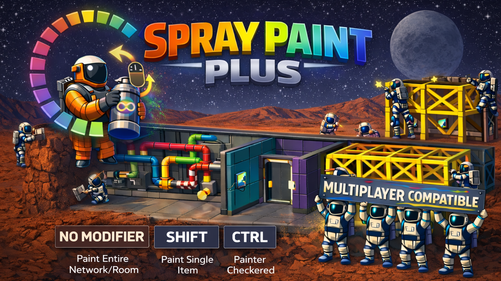

# Spray Paint Plus

Combines **color cycling**, **network painting**, **glow paint**, and **infinite spray paint** into one multiplayer-safe Stationeers mod.

Full multiplayer compatibility. Safe to remove from existing savegames.

> **WARNING:** This is a StationeersLaunchPad mod. It requires [BepInEx](https://docs.bepinex.dev/) and [StationeersLaunchPad](https://github.com/StationeersLaunchPad/StationeersLaunchPad) to be installed.

This mod builds on the excellent work of **Elmotrix** ([Color Cycler](https://steamcommunity.com/sharedfiles/filedetails/?id=3163662298), [Network Painter](https://steamcommunity.com/sharedfiles/filedetails/?id=2876605527)) and **Aspct** ([Infinite Spray Paint](https://steamcommunity.com/sharedfiles/filedetails/?id=3576112002)), whose original mods inspired this project. The multiplayer networking code in Color Cycler was contributed by **SubHobo** (bls220). Spray Paint Plus combines their ideas and fixes the multiplayer issues that affected clients in those mods.

## Installation

1. Copy `SprayPaintPlus.dll` and the `About/` folder into your Stationeers local mods directory
2. Disable the original Color Cycler, Network Painter, and Infinite Spray Paint mods
3. Restart the game

## Features

### Full Multiplayer Support
All features work correctly for every player, host and clients alike. Late-joining players see the correct spray can colors immediately.

### Color Cycling
Scroll your mouse wheel while holding a spray can to cycle through all available paint colors. No more carrying twelve cans in a backpack.
- Three modes, set by the **Color Cycling** setting: cycle every color (default), cycle only within the can's own paint family, or turn the wheel off entirely so each color needs its own printed can
- Both you and the server pick a mode, and the stricter of the two applies

### Color Picking (Eyedropper)
Right-click any paintable object while holding a spray can to copy that object's color onto the can. Left-click the next item to match, no hunting for the right color in the scroll cycle.
- **Ctrl+right-click** picks the *as-built* color the target would have coming out of its kit / build flow, independent of any later repaint. Useful when a structure has been repainted and you want to restore its original kit color
- **Shift+right-click** is reserved for future use (currently no-op)
- Works on any paintable object: pipes, cables, chutes, rails, walls, large structures, elevators, placed kits

### Infinite Spray Paint
All spray cans have unlimited uses and produce no pollution. Both are configurable.

### Network Painting
Spray-paint a pipe, cable, chute, robotic arm rail, elevator, ladder, stair flight, or stairwell and the entire connected network gets painted at once.
- **Hold Shift** to paint just a single item (or swap this default, see Settings)
- **Hold Ctrl** for a checkered/alternating paint pattern
- Works on: pipe networks (including hydroponic trays and passive vents as separate paint groups), cable networks, chute networks, robotic arm rail assemblies (rails, junctions, bypass pieces, and docks all share one paint set), and elevators (every shaft and level segment shares one paint set, including the with-cable and without-cable build variants; the moving carriage is painted on its own)
- Stairs connect every flight that forms one continuous staircase, both flights set side by side to widen it and flights run up or down to lengthen it; separate or crossing flights stay apart. Stairwells connect every adjacent stairwell block across all eight stairwell types and any orientation; a gap separates blocks. Ladders connect the vertical column, ladder end caps included; only ladders directly above or below in the same column and facing connect

### Room & Structure Painting
Spray-paint a wall and every same-type wall bounding the same room is painted. Spray-paint a frame, girder, or any other large structure and all orthogonally-connected structures of the same exact type are painted with it.
- Walls use the game's `Room` membership to decide the paint set. Paint spills across any wall the room touches, but never past a doorway into another room
- Large structures flood-fill on a grid using 6-neighbor (cardinal) adjacency only; diagonals are not followed
- Same Shift / Ctrl modifiers apply

### Extra Paintable Structures
Some structures ship from the base game without a paintable surface, so the spray can ignores them. This mod adds the missing surface so they paint like their siblings.
- Currently covers the **Steel Frame (Corner)** and **Steel Frame (Side)** shapes from the Steel Frames kit; the base Steel Frame and Steel Frame (Corner Cut) were already paintable
- Controlled by the **Extra Paintable Structures** setting (default on), which you and the server both have to allow
- Painted frames also flow through Network Paint Large Structures like any other connected structure
- More normally-unpaintable structures will be added in future versions

### Glow Paint

*Flavour: classified ODA research paint; the datasheet redacts everything below "handle with gloves".*

The **Spray Paint Gun** becomes a self-contained glow applicator. Point at any painted target and fire; the target keeps its existing color and gains a glow halo, visible in unlit rooms. Every vanilla paint color supports glow.
- Gun is ammo-less. It no longer accepts spray cans; its can slot is hidden in the inventory
- Gun never changes a target's color. To change color, paint with a plain can first; then fire the gun to add glow
- Shift (single target) and Ctrl (checkered pattern) modifiers apply to gun-paint too
- Right-click the gun to switch between **Add Glow** and **Remove Glow** modes (the vanilla on/off toggle, HUD label rebranded)
- Color and glow are orthogonal: a can paint only changes color, a gun fire only changes glow
- Glow state persists across save/load and syncs correctly in multiplayer; every connected player sees the same glowing targets
- The **Glow Paint** setting turns the feature off on either side; when off, the gun reverts to the vanilla can-accepting behavior. Glow other players applied stays visible to you either way

### Safe to Uninstall

You can remove Spray Paint Plus from an existing save without breaking it. Saves written by v1.6.0+ store glow state in a side-car file (`sprayplus-glow.xml`) inside the save ZIP, alongside the vanilla `world.xml`. When the mod is absent, the vanilla loader silently ignores the side-car; the world still opens, and glowing targets render as plain painted targets. Re-install later and load a save you wrote before removing the mod, and the glow is restored. Saves you wrote during an uninstalled period are fully vanilla (no glow state to recover).

### Settings

All features are configurable via the mod settings panel.

**Settings come in pairs.** Every capability has a client half and a server half, and it works only when both allow it. Your half decides what you personally do, never what you see: a player with glow paint switched off still sees the glow other players applied. The host's half decides what the world allows at all. Neither half can grant what the other refuses, and switching off either one is enough to disable the capability.

Single-player and hosting count as the server. Both halves are local, both apply, and either one can switch a capability off, exactly as on a dedicated server.

You are told when a mismatch matters. On joining a server you get one console message naming every function you have enabled that the server does not allow, and a message the first three times you actually try to use one. Your own settings are never rewritten; they just have no effect there.

Three settings have no partner. **Paint Single Item By Default** and **Invert Color Scroll Direction** are pure input mapping, where a server has no sensible opinion. **Suppress Spray Paint Pollution** is server-only, because the atmosphere is shared and one player opting out would change the air for everybody.

The [Metallic Paints DLC](https://store.steampowered.com/app/4842920) gate sits on top of all of this and no setting can move it. Without the DLC in the session the four metallic colors (Obsidian, Silver, Bronze, Gold) stay locked whatever the color cycling mode is, exactly as in the base game.

The in-game settings panel groups the 35 entries under eleven headers, six client and five server. Groups sort alphabetically, so every **Client** group appears above every **Server** group.

**Client - Color Cycling**:

| Setting | Default | Description |
|---|---|---|
| Color Cycling | Cycles through all colors | How the mouse wheel changes a spray can's color. Cycles within paint family keeps a base-color can on the twelve base colors and a metallic can on the four metallic ones. Can cannot change color turns the wheel off, so you print one can per color. If the server is set to something stricter, the stricter setting applies and you are told when you join |
| Color Picking | On | Right-click a painted object with a spray can in hand to copy its color onto the can. Hold Ctrl to copy the color it was built with instead. Does nothing when Color Cycling is set to Can cannot change color |

**Client - Consumables**:

| Setting | Default | Description |
|---|---|---|
| Unlimited Spray Paint Uses | On | Keeps your own spray cans from being used up. Turn it off to have your cans deplete normally even on a server that allows unlimited use |

**Client - Glow Paint**:

| Setting | Default | Description |
|---|---|---|
| Glow Paint | On | Use the Spray Paint Gun to add and remove a glow on already-painted objects. Turn it off to get the base game gun that loads a spray can. Glow that other players apply stays visible to you whatever this is set to |

**Client - Network Painting**:

| Setting | Default | Description |
|---|---|---|
| Network Painting | On | One spray stroke paints a whole connected set: a pipe run, a cable network, a staircase, the walls of a room. Turn it off to always paint one item at a time. The entries below leave out individual kinds of network; each one also has to be allowed by the server |
| Network Paint Pipes | On | Includes pipe networks (pipes, passive vents, hydroponic trays) when your stroke paints a whole network. No effect if Network Painting is off |
| Network Paint Cables | On | Includes cable networks when your stroke paints a whole network. No effect if Network Painting is off |
| Network Paint Chutes | On | Includes chute networks when your stroke paints a whole network. No effect if Network Painting is off |
| Network Paint Walls | On | Includes all same-type walls bounding the same room when your stroke paints a whole network. No effect if Network Painting is off |
| Network Paint Rails | On | Includes every rail, junction, bypass and dock on one robotic arm assembly. No effect if Network Painting is off |
| Network Paint Large Structures | On | Includes connected large structures such as frames and girders. No effect if Network Painting is off |
| Network Paint Elevators | On | Includes every shaft and level segment of one elevator. The carriage is painted on its own. No effect if Network Painting is off |
| Network Paint Ladders | On | Includes the whole ladder column and its end caps. No effect if Network Painting is off |
| Network Paint Stairs | On | Includes a whole staircase across its width and its climb. No effect if Network Painting is off |
| Network Paint Stairwells | On | Includes every adjacent stairwell block, all eight types, any orientation. No effect if Network Painting is off |

**Client - Paintability**:

| Setting | Default | Description |
|---|---|---|
| Extra Paintable Structures | On | Spray-paint structures the base game leaves unpaintable, currently Steel Frame (Corner) and Steel Frame (Side). Both you and the server need this on or painting them does nothing at all. Applies at game start, so changing it needs a restart |

**Client - Preferences**:

| Setting | Default | Description |
|---|---|---|
| Paint Single Item By Default | Off | Painting targets a single item by default and Shift paints the whole network instead. Purely local; the server has no say |
| Invert Color Scroll Direction | Off | Reverses the mouse wheel direction when scrolling through colors. Purely local; the server has no say |

**Server - Color Cycling**:

| Setting | Default | Description |
|---|---|---|
| Color Cycling | Cycles through all colors | The most permissive color cycling allowed on this server. Cycles within paint family makes players print a metallic can to reach metallic colors. Can cannot change color turns the wheel off for everyone, so a can keeps whatever color it has now. Metallic Paints DLC rules apply on top of this whatever it is set to |
| Color Picking | On | Allows right-click color copying from a painted object onto a spray can. Turn it off to keep colors coming only from printed cans |

**Server - Consumables**:

| Setting | Default | Description |
|---|---|---|
| Unlimited Spray Paint Uses | On | Makes spray cans infinite. Players can still choose to have their own cans deplete |
| Suppress Spray Paint Pollution | On | Stops spray cans releasing pollutant gas. There is no player-side version of this one: the atmosphere is shared, so one player opting out would change the air for everybody |

**Server - Glow Paint**:

| Setting | Default | Description |
|---|---|---|
| Glow Paint | On | Allows the Spray Paint Gun to add and remove glow. When off, the gun works as it does in the base game and loads a spray can |

**Server - Network Painting**:

| Setting | Default | Description |
|---|---|---|
| Network Painting | On | Allows one stroke to paint a whole connected set. The entries below choose which kinds of network qualify on this server |
| Network Paint Pipes | On | Includes pipe networks (pipes, passive vents, hydroponic trays) when painting a whole network. No effect if Network Painting is off |
| Network Paint Cables | On | Includes cable networks when painting a whole network. No effect if Network Painting is off |
| Network Paint Chutes | On | Includes chute networks when painting a whole network. No effect if Network Painting is off |
| Network Paint Walls | On | Includes all same-type walls bounding the same room when painting a whole network. No effect if Network Painting is off |
| Network Paint Rails | On | Includes every rail, junction, bypass and dock on one robotic arm assembly. No effect if Network Painting is off |
| Network Paint Large Structures | On | Includes connected large structures such as frames and girders. No effect if Network Painting is off |
| Network Paint Elevators | On | Includes every shaft and level segment of one elevator. The carriage is painted on its own. No effect if Network Painting is off |
| Network Paint Ladders | On | Includes the whole ladder column and its end caps. No effect if Network Painting is off |
| Network Paint Stairs | On | Includes a whole staircase across its width and its climb. No effect if Network Painting is off |
| Network Paint Stairwells | On | Includes every adjacent stairwell block, all eight types, any orientation. No effect if Network Painting is off |

**Server - Paintability**:

| Setting | Default | Description |
|---|---|---|
| Extra Paintable Structures | On | Allows the extra paintable structures to be painted on this server. Applies at server start |

## Compatibility

**Requires:** BepInEx + StationeersLaunchPad

**Incompatible with** (detected at startup; the mod refuses to load if either is found):
- [Color Cycler](https://steamcommunity.com/sharedfiles/filedetails/?id=3163662298) by Elmotrix
- [Network Painter](https://steamcommunity.com/sharedfiles/filedetails/?id=2876605527) by Elmotrix

**Redundant** (not detected, but pointless to run alongside this mod; disable to avoid confusion):
- [Infinite Spray Paint](https://steamcommunity.com/sharedfiles/filedetails/?id=3576112002) by Aspct
- [Infinite Paint Mod](https://steamcommunity.com/sharedfiles/filedetails/?id=1761980496) by Dingo

**All players** on a server must have Spray Paint Plus installed. Matching mod versions are enforced during the connection handshake automatically.

**Dedicated servers** need the same BepInEx + StationeersLaunchPad + SprayPaintPlus setup installed server-side. The paint logic runs server-authoritatively and the handshake rejects mixed installs.

## Reporting Issues

If you run into a bug or something behaves unexpectedly, please open an issue on [GitHub](https://github.com/SixFive7/StationeersPlus/issues). Please include the mod name in the title so reports can be triaged. Steam comment notifications don't always come through, so GitHub is the reliable way to make sure a report is seen.

## Changelog

Full version history lives in [`CHANGELOG.md`](CHANGELOG.md). Each release is also published on the [Steam Workshop Change Notes tab](https://steamcommunity.com/sharedfiles/filedetails/changelog/3702940349).

## Credits

Spray Paint Plus would not exist without the modders who came before:

- **Elmotrix**: Created [Color Cycler](https://steamcommunity.com/sharedfiles/filedetails/?id=3163662298) and [Network Painter](https://steamcommunity.com/sharedfiles/filedetails/?id=2876605527), the original spray paint enhancement mods for Stationeers. The core ideas of scroll-to-cycle and paint-entire-networks are theirs.
- **SubHobo** (bls220): Contributed the initial multiplayer networking code to Color Cycler via [PR #1](https://github.com/Elmotrix/ColorCyclerMod/pull/1).
- **Aspct**: Created [Infinite Spray Paint](https://steamcommunity.com/sharedfiles/filedetails/?id=3576112002), the original clean infinite paint mod for Stationeers.
- **Dingo (DingoPD)**: Created the original [Infinite Paint Mod](https://steamcommunity.com/sharedfiles/filedetails/?id=1761980496), the first infinite spray paint mod for Stationeers.

## License

Apache License 2.0. See [LICENSE](../../LICENSE) for the full text and [NOTICE](../../NOTICE) for attribution.
