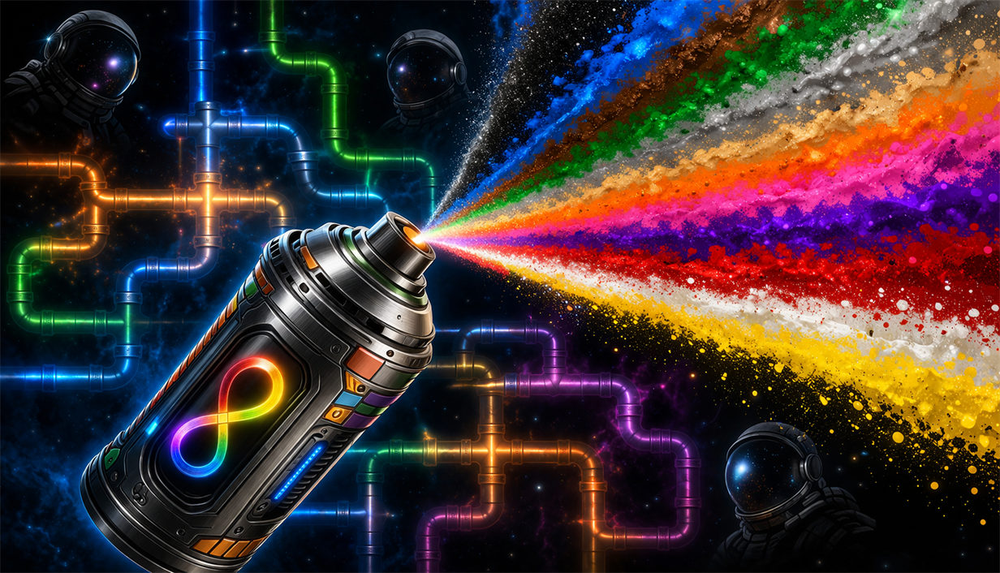

# Spray Paint Plus [StationeersLaunchPad]

A combined Stationeers mod that brings together **color cycling**, **network painting**, and **infinite spray paint** into a single mod that now also fully supports multiplayer.

> **WARNING:** This is a StationeersLaunchPad mod. It requires [BepInEx](https://docs.bepinex.dev/) and [StationeersLaunchPad](https://github.com/StationeersLaunchPad/StationeersLaunchPad) to be installed.

This mod builds on the excellent work of **Elmotrix** ([Color Cycler](https://steamcommunity.com/sharedfiles/filedetails/?id=3163662298), [Network Painter](https://steamcommunity.com/sharedfiles/filedetails/?id=2876605527)) and **Aspct** ([Infinite Spray Paint](https://steamcommunity.com/sharedfiles/filedetails/?id=3576112002)), whose original mods inspired this project. The multiplayer networking code in Color Cycler was contributed by **SubHobo** (bls220). Spray Paint Plus combines their ideas and fixes the multiplayer issues that affected clients in those mods.

## Installation

1. Copy `SprayPaintPlus.dll` and the `About/` folder into your Stationeers local mods directory
2. Disable the original Color Cycler, Network Painter, and Infinite Spray Paint mods
3. Restart the game

## Features

### Full Multiplayer Support
All features work correctly for every player, host and clients alike. Late-joining players see the correct spray can colors immediately.

### Color Cycling
Scroll your mouse wheel while holding a spray can to cycle through all available paint colors. No more carrying twelve cans in a backpack.

### Infinite Spray Paint
All spray cans have unlimited uses and produce no pollution. Both are configurable.

### Network Painting
Spray-paint a pipe, cable, or chute and the entire connected network gets painted at once.
- **Hold Shift** to paint just a single item (or swap this default, see Settings)
- **Hold Ctrl** for a checkered/alternating paint pattern
- Works on: pipe networks (including hydroponic trays and passive vents as separate paint groups), cable networks, chute networks

### Room & Structure Painting
Spray-paint a wall and every same-type wall bounding the same room is painted. Spray-paint a frame, girder, or any other large structure and all orthogonally-connected structures of the same exact type are painted with it.
- Walls use the game's `Room` membership to decide the paint set. Paint spills across any wall the room touches, but never past a doorway into another room
- Large structures flood-fill on a grid using 6-neighbor (cardinal) adjacency only; diagonals are not followed
- Same Shift / Ctrl modifiers apply

### Settings

All features are configurable via the mod settings panel.

**Client settings** (personal preference, each player sets independently):

| Setting | Default | Description |
|---|---|---|
| Invert Color Scroll Direction | Off | Reverse the scroll wheel direction |
| Paint Single Item By Default | Off | Swap Shift behavior: single paint by default, hold Shift for network paint |

**Server settings** (the server's value controls gameplay for everyone):

| Setting | Default | Description |
|---|---|---|
| Unlimited Spray Paint Uses | On | Infinite spray cans |
| Suppress Spray Paint Pollution | On | No pollutant gas when spraying |
| Enable Network Painting | On | Paint entire networks at once |
| Network Paint Pipes | On | Include pipes in network painting |
| Network Paint Cables | On | Include cables in network painting |
| Network Paint Chutes | On | Include chutes in network painting |
| Network Paint Walls | On | Paint all same-type walls bounding the same room |
| Network Paint Large Structures | On | Paint connected frames, girders, and other large structures in a 6-neighbor grid |

## Compatibility

**Requires:** BepInEx + StationeersLaunchPad

**Incompatible with** (detected at startup; the mod refuses to load if either is found):
- [Color Cycler](https://steamcommunity.com/sharedfiles/filedetails/?id=3163662298) by Elmotrix
- [Network Painter](https://steamcommunity.com/sharedfiles/filedetails/?id=2876605527) by Elmotrix

**Redundant** (not detected, but pointless to run alongside this mod; disable to avoid confusion):
- [Infinite Spray Paint](https://steamcommunity.com/sharedfiles/filedetails/?id=3576112002) by Aspct
- [Infinite Paint Mod](https://steamcommunity.com/sharedfiles/filedetails/?id=1761980496) by Dingo

**All players** on a server must have Spray Paint Plus installed. Matching mod versions are enforced during the connection handshake automatically.

**Dedicated servers** need the same BepInEx + StationeersLaunchPad + SprayPaintPlus setup installed server-side. The paint logic runs server-authoritatively and the handshake rejects mixed installs.

## Reporting Issues

If you run into a bug or something behaves unexpectedly, please open an issue on [GitHub](https://github.com/SixFive7/SprayPaintPlus/issues). It would be greatly appreciated. Steam comment notifications don't always come through, so GitHub is the reliable way to make sure a report is seen.

## Credits

Spray Paint Plus would not exist without the modders who came before:

- **Elmotrix**: Created [Color Cycler](https://steamcommunity.com/sharedfiles/filedetails/?id=3163662298) and [Network Painter](https://steamcommunity.com/sharedfiles/filedetails/?id=2876605527), the original spray paint enhancement mods for Stationeers. The core ideas of scroll-to-cycle and paint-entire-networks are theirs.
- **SubHobo** (bls220): Contributed the initial multiplayer networking code to Color Cycler via [PR #1](https://github.com/Elmotrix/ColorCyclerMod/pull/1).
- **Aspct**: Created [Infinite Spray Paint](https://steamcommunity.com/sharedfiles/filedetails/?id=3576112002), the original clean infinite paint mod for Stationeers.
- **Dingo (DingoPD)**: Created the original [Infinite Paint Mod](https://steamcommunity.com/sharedfiles/filedetails/?id=1761980496), the first infinite spray paint mod for Stationeers.
